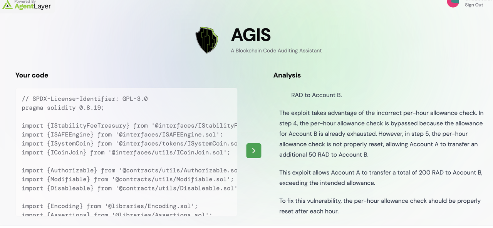

AGIS, initially developed as an AI Agent in the AgentLayer ecosystem, integrates AI technology with blockchain code auditing. It offers exceptional efficiency and a comprehensive validating mechanism. In a pivotal bug hunting contest, AGIS independently uncovered 21 critical or important vulnerabilities, showcasing its real-world effectiveness in smart contract security auditing.
 
As a high-performing specialized AI agent, AGIS provides full-scale smart contract auditing services, swiftly identifying logical flaws and economic model-related risks. It supports almost all major blockchain programming languages, including but not limited to Solidity, Rust, Move, Func, Go, Clarity and Cairo. 
 
AGIS also serves as a dynamic validating platform where auditors and developers can publish or accept tasks to validate vulnerabilities and earn rewards. This incentivizes thorough vulnerability checks and ensures fair compensation for contributors.
 
The light version of AGIS is available on the AgentLayer ecosystem, with over 180,000 page views in its first month online.
