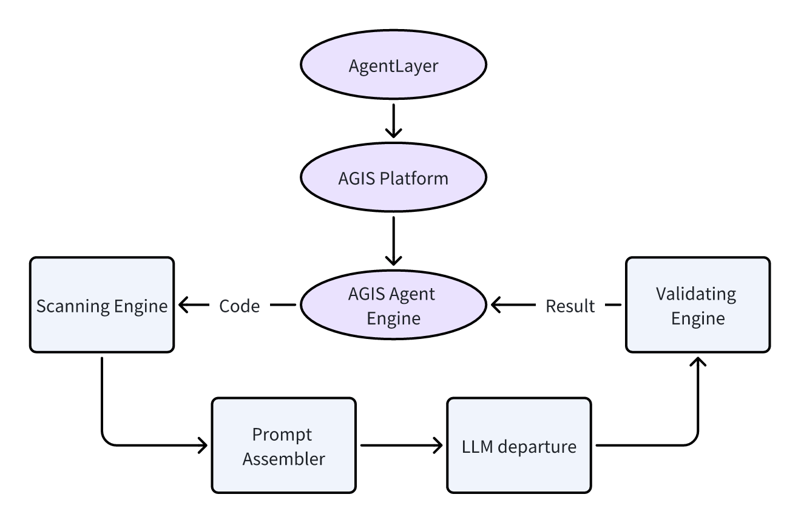
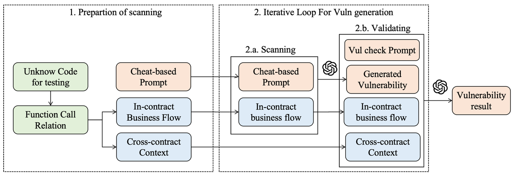

AGIS leverages advanced large language models like GPT-4,  Llama 3 and proprietary security foundation model TrustLLM to enhance blockchain security. The system utilizes these AI technologies to:

1. Perform comprehensive smart contract audits
2. Detect vulnerabilities with high efficiency and accuracy
3. Analyze code for logical flaws and economic risks
By integrating AI capabilities, AGIS aims to revolutionize smart contract auditing in the Web3 ecosystem, offering improved security and reliability for blockchain projects.
# Building Blocks of AGIS Platform

 
The core of AGIS Platform is the AGIS Agent, an intelligent agent that interacts with external systems via a secure HTTP interface. It uses private keys and a unique ID for authentication. The system employs three key prompt components:

1. CorePrompt: Defines core audit tasks, focusing on logical errors.
2. PeripheryPrompt: Sets audit context, simulating expert thinking.
3. VulCheckPrompt: Performs secondary confirmation of vulnerabilities.

PromptAssembler combines these components for efficient LLM interaction.

# Detection Workflow

 
AGIS's vulnerability detection workflow showcases its innovative approach:

1. Receives smart contract code
2. Uses context for vulnerability scanning
3. Leverages LLM’s capabilities for continuous scanning
4. Employs automated validation to confirm vulnerabilities and reduce false positives
5. Outputs final results

This streamlined process combines AI efficiency with validation mechanisms for accurate smart contract auditing.
# Iterative Optimization & Privacy Protection
AGIS features two key technological highlights:

1. Iterative Optimization:
  - Performs multiple analysis cycles on each code sample
  - Adjusts prompt strategy based on previous results
  - Adapts to different code complexities and styles
  - Continuously improves performance over time
2. Privacy Protection:
  - Uses environmental variables to store sensitive information
  - Temporarily stores smart contracts for re-scanning
  - Allows immediate deletion by users or auto-deletes after 24 hours
  - Implements additional security measures to protect user privacy

Overall, AGIS represents a major advancement in AI-driven code auditing for blockchain security. It combines:

3. Advanced language model technology
4. Carefully designed prompt engineering
5. Multi-layer verification mechanisms

These features enable AGIS to provide innovative solutions for smart contract security. As the system evolves, it has the potential to become a crucial tool in blockchain security, contributing to the development of more secure and reliable decentralized systems.
