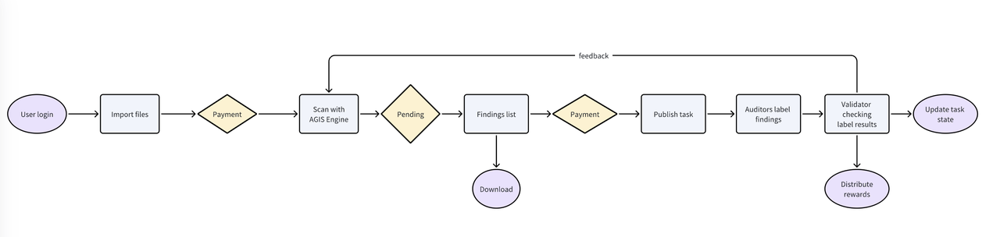

AGIS is an AI-powered auditing platform for real-time smart contract and token audits. It offers:
1. Smart contract scanning
2. Detailed vulnerability reports
3. Labeling tasks for auditors and validators
Participants can earn rewards by validating scan results through a crowdsourced model. This streamlined approach combines AI efficiency with human expertise for comprehensive blockchain security.
