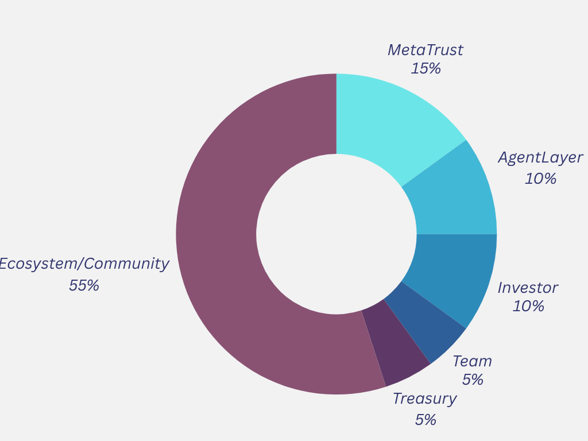

# Tokenomics

## Distribution

- 55% Ecosystem/Community
- 25% Early Contributor
- 10% Investor
- 5% Team
- 5% Treasury/Foundation Reserve

## AGIS Utility
1. Platform Fee: Users pay $AGIS for smart contract vulnerability scanning.
2. Task Publishing:
  2.1 Users create audit tasks and allocate $AGIS rewards
  2.2 Auditors and validators earn $AGIS for labeling scan results
  2.3 Rewards based on accuracy and contribution value
  2.4 Malicious actors risk $AGIS stake slashing
3. Staking/Slashing Mechanism: Auditors and validators stake $AGIS to prevent malicious behavior.
4. Liquidity Incentives: Users providing $AGIS liquidity on DeFi protocols earn rewards, strengthening the ecosystem.
5. Discount for task scanning
6. Free task scanning, worth $50, for a $AGIS long-term whale staker
