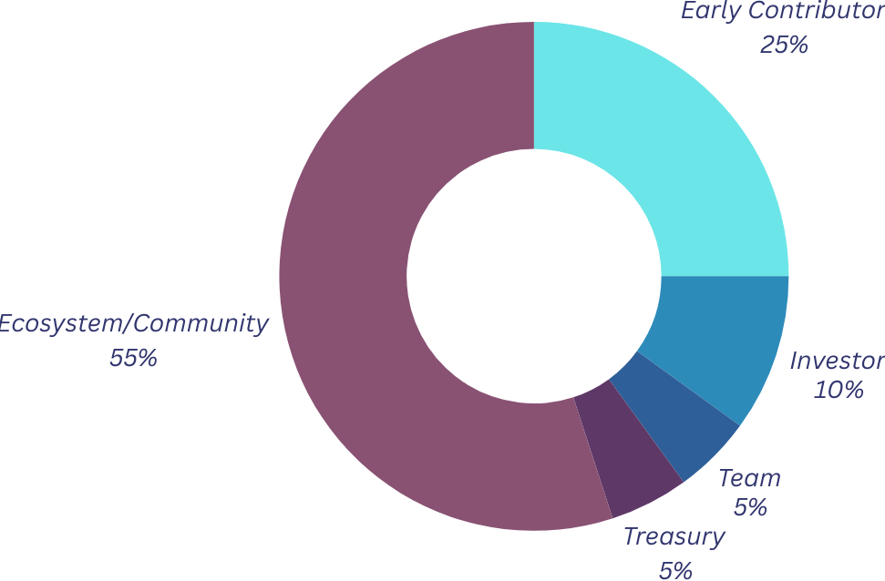

# Tokenomics

## Distribution

- 55% Ecosystem/Community
- 10% AgentLayer Token Holders (2.5% reserved for APGN Holders)
- 20% MetaTrust 
- 5% Team
- 5% Treasury/Foundation Reserve
- 5% Investor

## Protocol Revenue
- Platform Fees: Users pay $AGIS for scanning services.
- Task Publishing: Developers create audit tasks and allocate rewards for vulnerability discovery and validation.
- Staking Mechanism: Auditors and validators stake $AGIS to prevent malicious behavior.
- Reward Distribution: Fair compensation based on contribution accuracy and value.
